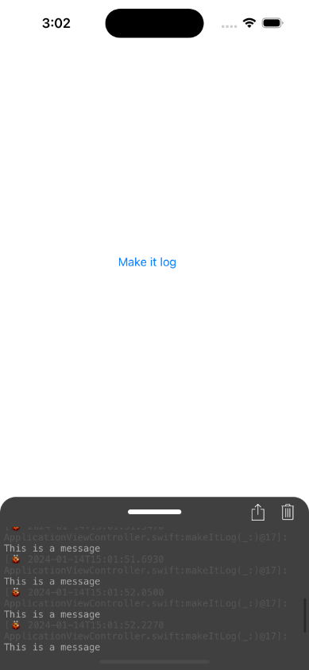

 

#  TeenyConsole

This is a reimplementation of the an idea based on [Cosmo/TinyConsole](https://github.com/Cosmo/TinyConsole) designed to test the idea of implementing a tiny console output into an App which is using storyboards as it's primary UI 

# Why?

Because I use storyboards, I like storyboards, I want to continue using storyboards AND I'd like to have some way to glance at the output of the App when it's been tested

Most of the Apps I work on already have a predefined logging work flow.  I need something which can be "plugged" into that workflow, rather then replacing or circumventing it.

Because it's a learning oppurtunity
